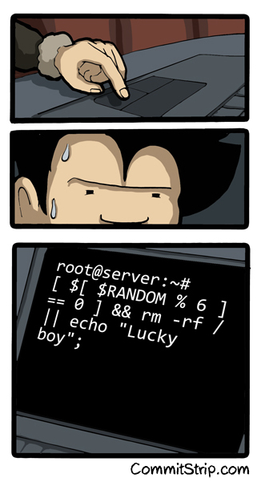
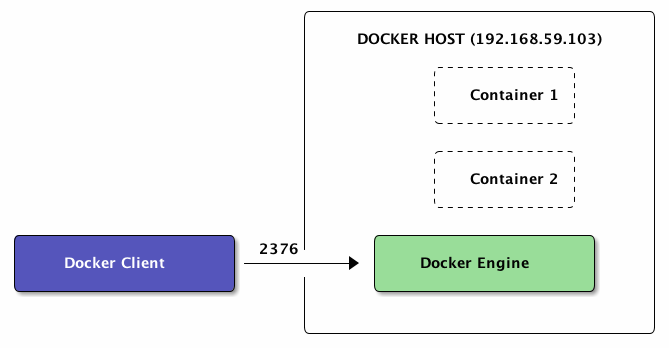
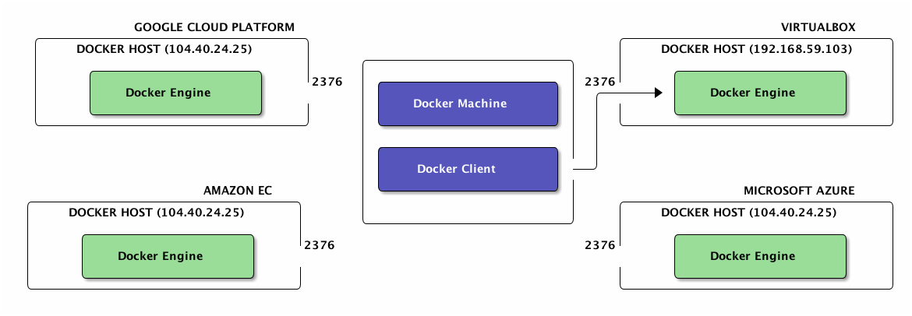

# Déploiement dans le "cloud"



Notes :
Il y a 2 sujets ici :
- Comment avec un CLI parler à plusieurs host et faire des liens entre
  eux (swarm)
- Les patterns d'usage (ambassador, découverte, ..)


## Docker Host distant


```bash
    export DOCKER_HOST=tcp://192.168.59.103:2376
    export DOCKER_CERT_PATH=/Users/mariolet/.boot2docker/certs/boot2docker-vm
    export DOCKER_TLS_VERIFY=1
```

Notes :
Nous avons vu pour l'instant la configuration classique : client, engine conteneurs Docker sur la même machine hôte. Dans cette section il s'agira d'associer un docker client avec un docker engine distant.
Pour mettre en place une telle configuration il suffit de setter des variables d'environnement.
Pour le reste les commandes sont identiques à celles qu'on a vu jusquà présent.
Un docker host est une VM où le engine Docker tourne et est en écoute sur le port 2375 ou 2376 (SSL)
Comment créer un docker host distant ? Avec boot2docker par exemple. Mais depuis quelques mois il existe un autre outil...


## Docker Machine

Outil pour créer et gérer des Docker hosts. Distants ou pas.


Providers déjà supportés : <br/>
*Amazon EC2*, *Microsoft Azure*, *Microsoft Hyper-V*, *DigitalOcean*, *Google Compute Engine*, *OpenStack*, *Rackspace*, *SoftLayer*, *VirtualBox*, *VMware Fusion*, *VMware vCloud Air*, *VMware vSphere*

Notes :
Docker machine est un outils qui permet de creer et administrer des VM ou l'on pourra deployer des conteneurs. Ces VM peuvent être en local (VirtualBox et VMWare Fusion) ou distantes (Amazon EC2, Azure, GCE etc...). La puissance du IaaS avec la convention et le standard des conteneurs Docker. 
Les fonctionnalités de Docker Machine ressemblent beaucoup à celles de Vagrant. 
Le 26 Février 2015 a été releasée la version beta de Docker Machine.
Nous allons nous en servir pour deployer des containers distants.


## Docker Machine (commandes)

<br/><br/><br/>
Commandes, disponibles : <br/>

* *create*, *rm*, *update*
* *env*, *ip*, *inspect*
* *ssh*


Notes :
Docker Machine permet la géstion de host Docker :
    création et élimination
    informations sur la VM
    connections SSH


## Déploiement dans le cloud - Demo
<br/>
*GCE*, *Amazon EC2*, *Microsoft Azure*, *Virtualbox*<br/>

1. Configuration du service (operations manuelles)
2. Creation de la machine
```bash
docker-machine create -d <driver> [DRIVER-SPECIFIC-OPTIONS] <machine-name>
```
3. Activer le flux TCP en entrée (opération manuelle)
4. Setup du client
```bash
$(docker-machine env)
```
5. Utilisation du client Docker
```bash
docker run -d zenika/nodejs-sample-app
```

