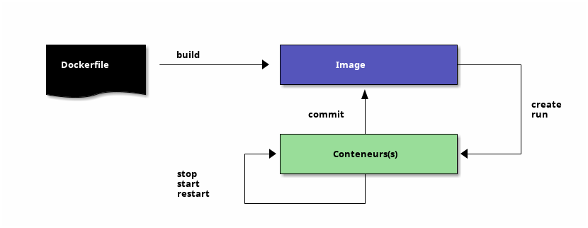

# Cycle de vie (bis)


## Rappels


Notes :
- TODO update the schema and use ditaa :)
<!---  -->
<!--  -->


## Images : quelques commandes en plus

- ``history`` : voir l'historique d'une image
- Option ``--tree`` : voir l'arbre des layers de chaque image
<br/><br/>
- ``save`` : sauvegarder dans une archive une images (avec ses layers)
- ``load`` : recharger une images (avec ses layers) à partir d'un tar

Notes :
- load, save -> à ne pas confondre avec export/load (sur conteneurs)
- history


## Publier vos images

1. ``tag`` : étiquetter une image dans un repository
```bash
$ docker tag monimage monimage
$ docker tag monimage privateregistry.com/vdemeester/monimage:latest
```
2. ``push`` : envoyer une image sur le repository (public ou privé)
```bash
$ docker push monimage
$ docker push privateregistry.com/vdemeester/monimage:latest
```
3. ``pull`` : récupérer une image depuis le repository
```bash
$ docker pull monimage
$ docker pull privateregistry.com/vdemeester/monimage:latest
```

Notes :
- pull/push, automated build.. <= publier vos images
- Local registry


## Dockerfile

- ``ENTRYPOINT`` : Définir un point d'entrée (*Wat?*)
  Override tout élément ``CMD`` ; permet de passer dans argument à un
  conteneur qui seront traités par le *entrypoint*

- ``ONBUILD`` : instruction qui sera exécuter quand une image sera
  construite à partir de la courante. Limité à ``RUN`` et ``ADD`` pour l'instant.
```bash
ONBUILD RUN /usr/local/bin/cabal install --only-dependencies
```

<br/><br/>


Notes :
- ENTRYPOINT : démo avec un echo :)
- ONBUILD : démo avec un build ?
- Rappels sur le comportement de certaines commande WORKDIR


## Conteneurs

Notes :
- export/import
- kill, wait, exec <-- make it work (enter)
- inspect, events, port, top, stats (1.5)
- cp : copies a folder out of a container fs
