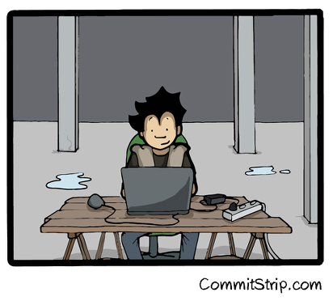

# Hands-on n.1

Notes:
- Une app qui a besoin de (SGBD [write], Elasticsearch [read/index],
  MQ [events], .. )
- TODO1 : mise en place ave fig/compose des env' pour le faire tourner
- TODO2 : coder une mini feature ? (bonus ?)
