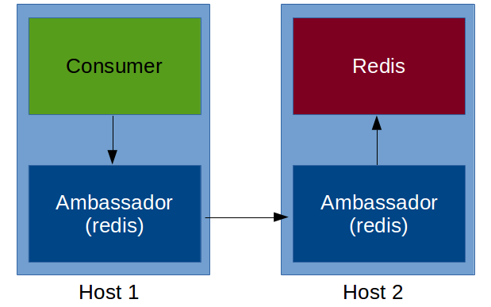

# Multi hôte


Notes :
Qu'est ce que c'est multi-hotes
Pourquoi multi-hotes
Docker swarm
Docker swarm (commandes)
Démo 


## Multi hôte (version manuelle)

- Deployer plusieurs conteneur sur des docker différents
- Faire les liens à la main..

```bash
$ export DOCKER_HOST=1.1.1.1
$ docker run -d --name postgres postgres
$ export POSTGRES_IP=$(docker inspect --format […])
$ export POSTGERS_PORT=5432
$ DOCKER_HOST=2.2.2.2 docker run -d --name backend \
    -e DB_PORT_5432_TCP_ADDR=${POSTGRES_IP} \
    -e DB_PORT_5432_TCP_PORT=${POSTGRES_PORT} mybackend
$ # …
```


Notes :
- POSTGRES_IP=$(docker inspect --format '{{.NetworkSettings.IPAddress}}' postgres


## Multi hôte (version ambassador)

- Utiliser ``--link`` sur le/les ambassadeur(s)
- Démarrer les embassadeurs avec la destination



Notes :
- https://docs.docker.com/articles/ambassador_pattern_linking/


## Docker swarm (1/2)

*Clustering made-in Docker*

- Aggrège des hôtes Docker
    - Manager & agent
      **TODO** schema (manager/agent)
- Le manager parle Docker
- Support de base plusieurs système de découverte (discovery)
    - etcd, consul, zookeeper, built-in, static


## Docker swarm (2/2)

- Place intelligement les conténeurs (scheduler)
    - ressources disponible vs demandée
    - mécanisme de filtre (contrainte, affinity, ..)<br/>
    ``-e constraint:storage==ssd``<br/>
    ``-e affinity:container==front``

- Mise en place
    - Manager :
    ``docker run --name swarm-manager -d -P swarm manage token://ef32[…]``
    - Agent (autre hote) :
    ``docker run --name swarm-agent -d -P swarm join
    --addr=${NODE_ID}:2375 token://ef32[…]``


## Multi hôte (version swarm)

- Mettre en place swarm (manager & agent)
- Faire pointer le client vers swarm (``DOCKER_HOST``, ..)
- ``$ docker run -d -e constraint:storage==ssd --name postgres postgres``
<br/>``$ docker run -d constraint:storage==redis --name redis redis``
<br/>``$ docker run -d --link redis:redis --link postgres:db --name backend backend``


<span style="font-size:0.85em; color: #666;">Note: Ça marchera un jour ;-)</span>

Notes :
- docker-compose
    - build KO
    - timeout rapidement => mettre à dispo les images
- docker run -d --name backend \
  -e DB_PORT_5432_TCP_ADDR=${IP1} -e DB_PORT_5432_TCP_PORT=${PORT1} \
  -e REDIS_PORT_6379_TCP_ADDR=${IP2} -e -REDIS_PORT_6379_TCP_PORT=${PORT2} \
  backend

