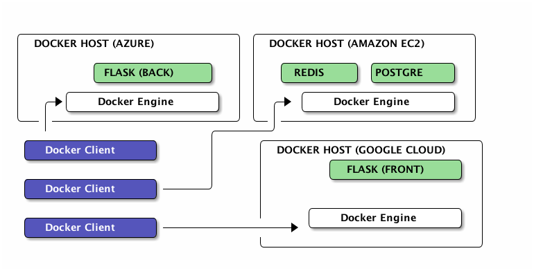
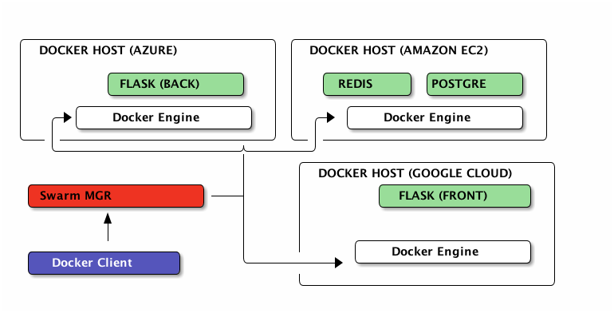

# Multi hôte


Notes :
Qu'est ce que c'est multi-hotes
Pourquoi multi-hotes
Docker swarm
Docker swarm (commandes)
Démo 


## Multi hôte
<br>



## Configuration manuelle

Faire les liens à la main...

```bash
## Run postgre container on Amazon
$ export DOCKER_HOST=tcp://54.93.99.223:2376
$ docker run -d --name postgres postgres

## Run backend container on Azure
$ export POSTGRES_IP=$(docker inspect --format […])
$ export POSTGERS_PORT=5432
$ DOCKER_HOST=tcp://104.42.136.179:2376
$ docker run -d --name backend \
    -e DB_PORT_5432_TCP_ADDR=${POSTGRES_IP} \
    -e DB_PORT_5432_TCP_PORT=${POSTGRES_PORT} mybackend
```


Notes :
- POSTGRES_IP=$(docker inspect --format '{{.NetworkSettings.IPAddress}}' postgres


## Docker Swarm (1/2)

*Clustering made-in Docker*



Notes :
- Aggrège des hôtes Docker
- Le manager parle Docker
- Support de base plusieurs système de découverte (discovery)
    - etcd, consul, zookeeper, built-in, static


## Docker swarm (2/2)

- Démarre intelligement les conténeurs (scheduler)
    - ressources disponible vs demandée
    - mécanisme de filtre (contrainte, affinity, ..)<br/>
    ``-e constraint:storage==ssd``<br/>
    ``-e affinity:container==front``

- Mise en place avec discovery statique
    - Manager :
    ``docker run --name swarm-manager -d -P swarm manage nodes://<node_ip1:2375>,<node_ip2:2375>,<node_ip3:2375>``


## Multi hôte (version swarm)

- Mettre en place swarm (manager & agent)
- Faire pointer le client vers swarm (``DOCKER_HOST``, ..)
- ``$ docker run -d --name postgres postgres``
<br/>``$ docker run -d -e affinity:container==postgres --name redis redis``
<br/>``$ docker run -d --link redis:redis --link postgres:db --name backend backend``


Notes :
- docker-compose
    - build KO
    - timeout rapidement => mettre à dispo les images
- docker run -d --name backend \
  -e DB_PORT_5432_TCP_ADDR=${IP1} -e DB_PORT_5432_TCP_PORT=${PORT1} \
  -e REDIS_PORT_6379_TCP_ADDR=${IP2} -e -REDIS_PORT_6379_TCP_PORT=${PORT2} \
  backend


## Multi hôte (version ambassador)

- Utiliser ``--link`` sur le/les ambassadeur(s)
- Démarrer les ambassadeurs avec la destination


Notes :
- https://docs.docker.com/articles/ambassador_pattern_linking/


