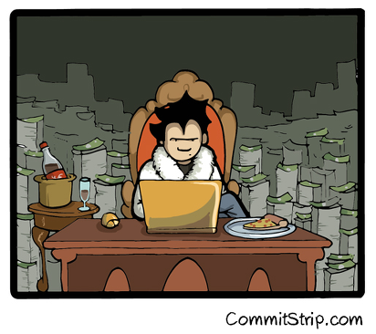

# Hands-on n.2

Notes :
- On utilise toujours https://github.com/vdemeester/flask-by-example
- Dans le premier exercie on deploie flask-by-example (application multi-container) sur un host distant (uniquement un). Le host distant peut-être aussi un VM virtualbox en local. Utiliser docker-machine. 
- Dans le deuxièem exerice on deploie les 3 containers de flask-by-example sur 3 Docker Hosts differents.

## Mission n.1 ~ niveau Ninja

En utilisant docker machine :
* Créer un nouveau Docker host (sur le cloud ou sur VirtualBox) 
* Déployer flask-by-example sur ce host

Hints :
* Utiliser la commande docker-machine create
* Penser à activer le flux TCP sur le port 80 si ce n'est pas le cas
* Configurer les variables d'environnments : $(docker-machine env)
* Utiliser docker-compose

## Mission n.2 ~ niveau Jedi

En utilisant docker machine :
* Créer un nouveau Docker host (sur le cloud ou sur VirtualBox) 
* Déployer flask-by-example sur ce host

Hints :
* Utiliser la commande docker-machine create
* Penser à activer le flux TCP sur le port 80 si ce n'est pas le cas
* Configurer les variables d'environnments : $(docker-machine env)
* Utiliser docker-compose

